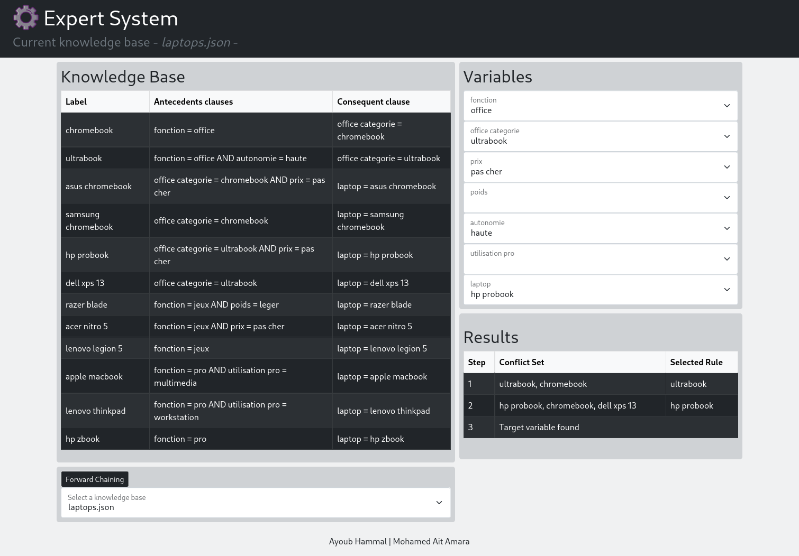
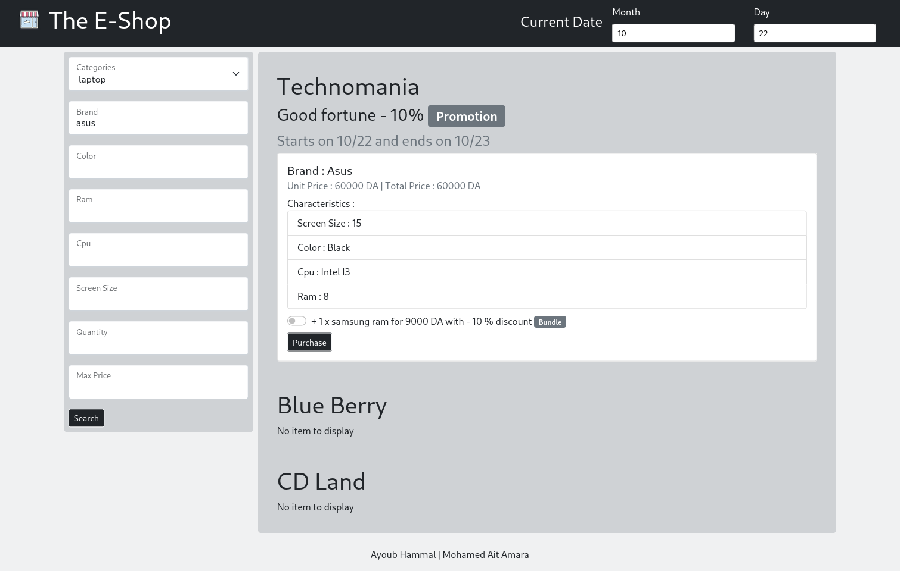

# University project on intelligent agents
Expert systems & Intelligent agents project.

## First part
### JavaFX version


The creation of a GUI desktop Java/JavaFX application powered by an *expert system*.

**Dependencies :**
- JavaFX
- Simple-Json

**Note** : the custum simple-json module is compiled from the simple-json package using :
```
jdeps --generate-module-info . <jar_path>
javac --patch-module <module_name>=<jar_path> <module_name>/module-info.java
jar uf <jar_path> -C <module_name> module-info.class
```
And then this new module is installed to the maven local repository, using :
```
mvn install:install-file -Dfile=<path-to-file> -DgroupId=<group-id> -DartifactId=<artifact-id> -Dversion=<version> -Dpackaging=<packaging>
```
For simple-json it would be :
```
mvn install:install-file -Dfile="lib/json-simple-1.1.1.jar" -DgroupId="com.googlecode.json-simple" -DartifactId="json-simple" -Dversion="1.1.1" -Dpackaging="jar"
```
To run the program use :
```
mvn clean javafx:run
```
The generation of the custom JRE running image is done using maven :
```
mvn clean javafx:jlink
```
And the generated image launcher is in `target/expertsystem/bin/launcher`.
### Spring Boot version



The same application but build using Spring Boot, ReactJS and Bootstrap.

First insall npm modules for the react app in the `app` directory, using :
```
npm install
```

Build the react app using :
```
npm run build
```

And then you can either run the project using :
```
mvn clean spring-boot:run
```

Or create a fat jar using :
```
mvn clean package spring-boot:repackage
```

The spring-boot server listens to the post 8000.

## Second part
### Using Spring Boot



This part is a multi-agents system using the [Jade library](https://jade.tilab.com/) that powers an e-commerce platform.
To install jade, run :
```
mvn install:install-file -Dfile="lib/jade.jar" -DgroupId="com.tilab.jade" -DartifactId="jade" -Dversion="4.5.0" -Dpackaging="jar"
```

First insall npm modules for the react app in the `app` directory, using :
```
npm install
```

Build the react app using :
```
npm run build
```

And then you can either run the project using :
```
mvn clean spring-boot:run
```

Or create a fat jar using :
```
mvn clean package spring-boot:repackage
```

The spring-boot server listens to the post 8000.

